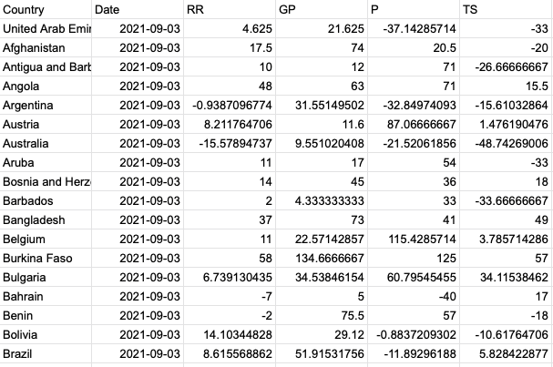
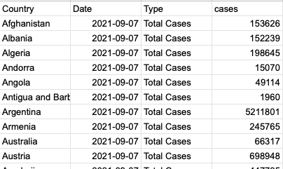
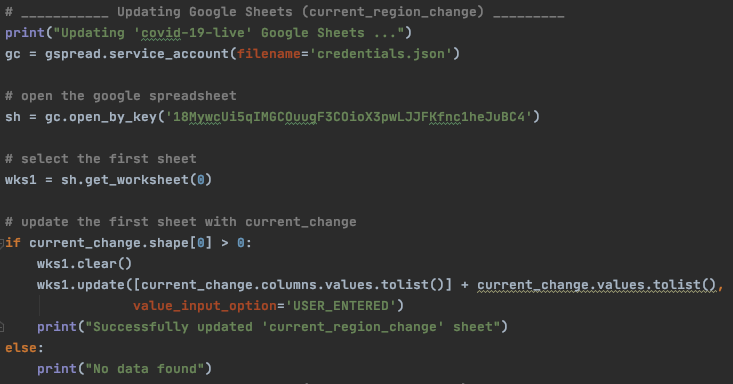

```{r setup, include=FALSE}
knitr::opts_chunk$set(echo = TRUE)
```

## Task

**The data is obtained from multiple sources** \doublespacing 

This is part of the assignment for the unit FIT3164 (Data Science Project), however it was something that I wanted to explore which would increase the UX overall. 

Practically, since we were dealing with Covid-19 data and visualising the results in multiple Tableau dashboards, it would be preferred to get updated daily. 

Therefore, this required myself to translate the current R script that was used for data analysis, into Python. This was decided because with the use of a Python package named "gspread", it allowed me to connect to Google Sheets to upload the data instead of converting it into csv, where I can use that as a server for Tableau to connect and update with the latest data within the Google Sheets (every 24 hours). 

This was not only vital in creating and presenting the latest data via Tableau dashboards, but also decreased the overall time needed for daily updates by more than 95%. From the tedious work of performing data analysis and refreshing each Tableau dashboard to then upload onto the website, by improving this process, it only required one click of a button to extract and perform data analysis on the latest data and have it updated on the corresponding Dashboard.

### (Example) Google Mobility Data Cleaned and Aggregated\doublespacing
https://docs.google.com/spreadsheets/d/18MywcUi5qIMGCOuugF3COioX3pwLJJFKfnc1heJuBC4/edit?usp=sharing
```{r photo, echo=FALSE, out.width = '70%'}

```

### (Example) General Statistics of the world and australia\doublespacing
https://docs.google.com/spreadsheets/d/1xijs9caUj9UaTcF4M7sxk9Jtu3RL_a3zuefaZGst1Os/edit?usp=sharing
```{r photo1, echo=FALSE, out.width = '50%'}

```

### Python Script used to update Google Sheets\doublespacing
(Cannot be shared on GitHub as it contains personal credentials)
```{r photo2, echo=FALSE, out.width = '70%'}

```

