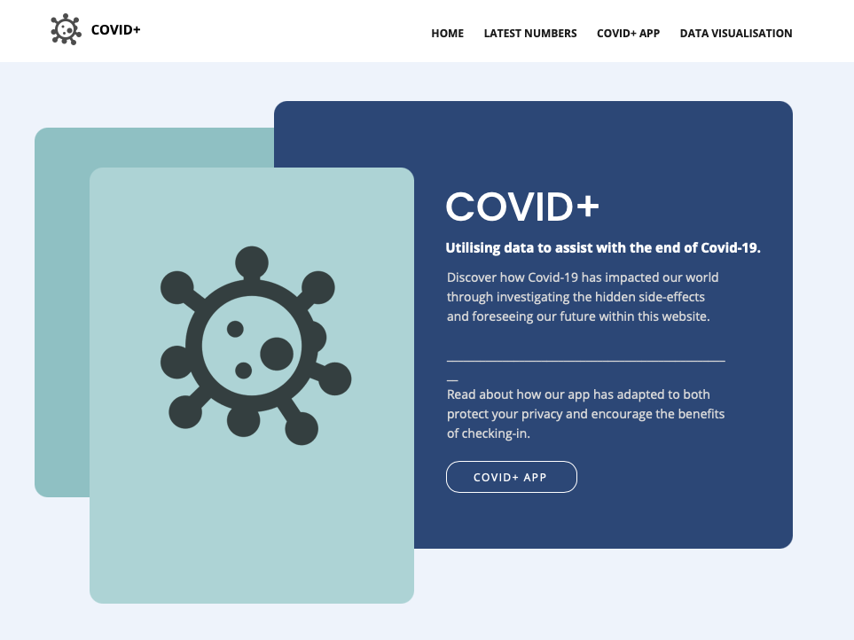
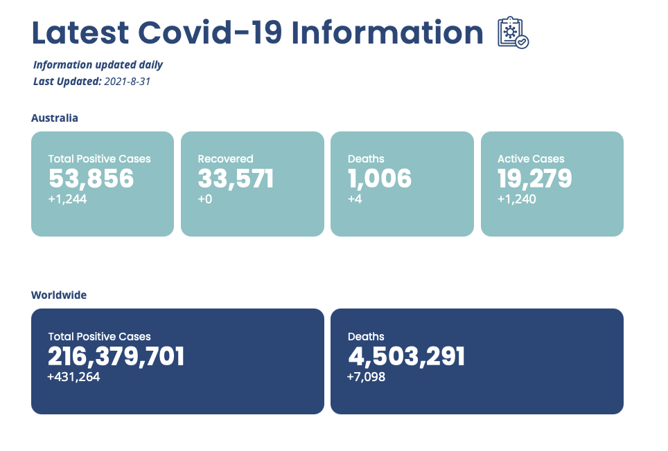
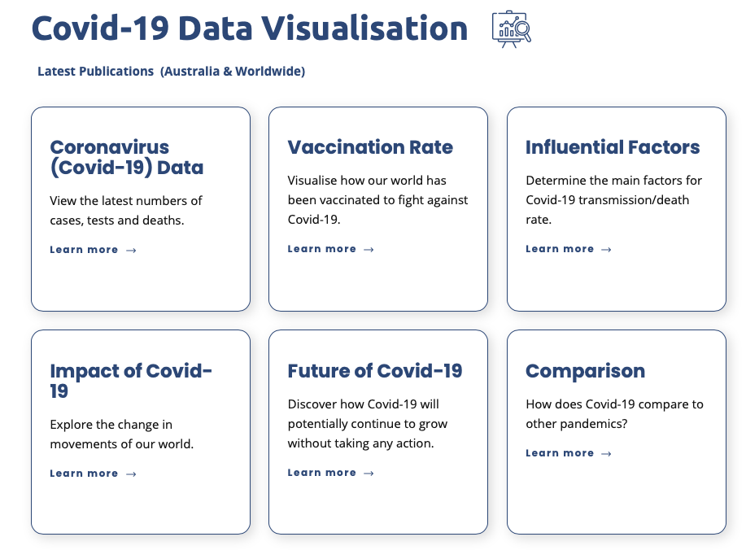
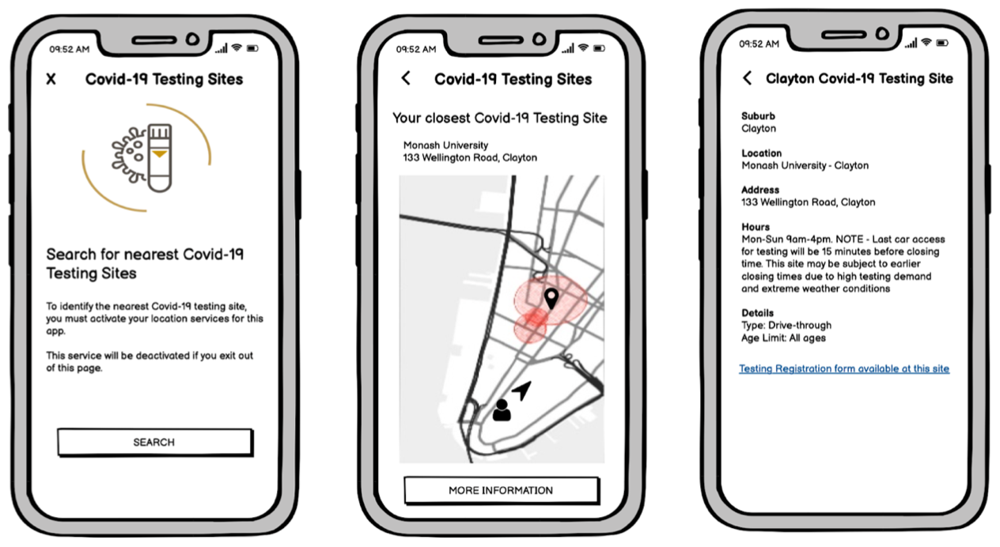

```{r setup, include=FALSE}
knitr::opts_chunk$set(echo = TRUE)
```

## Task

**The data is obtained from multiple sources and will noted in final report.**\doublespacing

This is a final year project conducted with 4 team members including myself based on the following topic chosen: Covid-19 Data Collection and Tracing Application.

The following project will challenge us to build an effective and unique covid-19 tracing application that will not only help in linking and identifying possible Covid-19 transmission but also provide a more centralized method of collecting personal information by businesses to trace any cases by the concerned health authorities. 

Therefore, the deliverable of our project includes building a new and improved Covid-19 application, as well as the website to store and present our data analysis research, which will most importantly store our analysis and findings of the Side Effects of Covid-19. This is our central idea which we would surround our project with and how we would ideally build our scope around.

Full project proposal is available upon request.\ 

**Expected Completion:** Oct-Nov\

**Website:**  \

### Database Draft\doublespacing

```{r photo, echo=FALSE, out.width = '70%'}

```

### Covid-19 Statistics API Extraction\doublespacing

```{r photo1, echo=FALSE, out.width = '70%'}

```

### Covid-19 Data Analysis Investigation \doublespacing
```{r photo2, echo=FALSE, out.width = '70%'}

```

### Sample Application Functionality\doublespacing
```{r photo3, echo=FALSE, out.width = '70%'}

```
