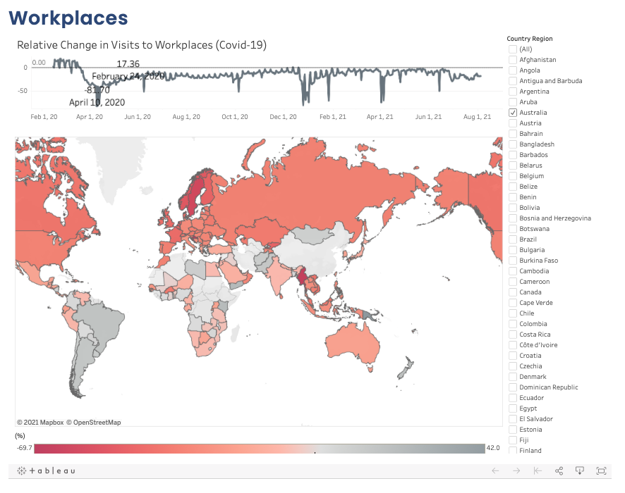

```{r setup, include=FALSE}
knitr::opts_chunk$set(echo = TRUE)
```

## Task

**The data is obtained from.** https://www.google.com/covid19/mobility/ \doublespacing 


This is part of the final year project developed by myself based on the following topic chosen: Covid-19 Data Collection and Tracing Application.

The Community Mobility Reports that is collected by Google aims to show how people have been changing their movement patterns while combating Covid-19.

These reports compare the different lengths and visits of a stay at different places to the baseline before Covid-19 changed our world (median value of the 5-week period Jan 3 - Feb 6, 2020). 

The different categories of locations include the following:

  - Workplaces
  - Parks 
  - Grocery & Pharmacy 
  - Transit Stations
  - Residential
  - Retail & Recreation
     
Google has used their data in the form of a pdf for each country and their regions collected. Whereas, I decided to aggregate the data to combine the regions into one country, and then create an interactive dashboard for each category to make it easier for comparisons between different countries. 

This is hosted on our project website, and can also be found within my Tableau Public account.\ 

**Tableau Dashboards Created:**

Workplaces:\ https://public.tableau.com/app/profile/ting.han.gan/viz/RelativeChangeinVisitstoWorkplacesCovid-19/W_DashBoard

Grocery and Pharmacy Stores: https://public.tableau.com/app/profile/ting.han.gan/viz/RelativeChangeinVisitstoGroceryandPharmacyStoresCovid-19/GP_DashBoard

Parks:\ https://public.tableau.com/app/profile/ting.han.gan/viz/RelativeChangeinVisitstoParksCovid-19/P_DashBoard

Residential:\ https://public.tableau.com/app/profile/ting.han.gan/viz/RelativeChangeinVisitstoResidentialCovid-19/R_DashBoard

Retail & Recreation:\ https://public.tableau.com/app/profile/ting.han.gan/viz/RelativeChangeinVisitstoRetailRecreationCovid-19/RR_DashBoard

Transit Stations:\ https://public.tableau.com/app/profile/ting.han.gan/viz/RelativeChangeinVisitstoTransitStationsCovid-19/TS_DashBoard

### Example Dashboard\doublespacing

```{r photo, echo=FALSE, out.width = '70%'}

```

