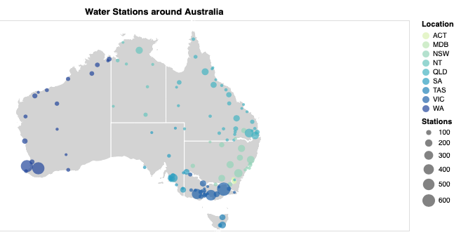

```{r setup, include=FALSE}
knitr::opts_chunk$set(echo = TRUE)
```

## Task

**The data is obtained from multiple sources** \doublespacing 

This assignment required myself to design and build an effective data visualisation for a specific domain. Similar to the Assignment 1 from FIT3179, but instead programming and designing within Vega-Lite visualisation library to create maps and diagrams. 

Therefore, a majority of the task that was required was to create a website that could store the data analysis that we have performed and displayed using Vega-Lite visualisation tools. By learning the fundamentals of JSON, Pure.css library and JavaScript/CSS/HTML libraries to create our webpage, it taught us new techniques and braoden our perspectives of just using the usual R or Python for presentation purposes. 

Within this assignment, R was used as a quick tool for analysing and cleaning each dataset. Within the datasets that I have analysed, something worth mentioning is with regards to clustering water stations within Australia to display them in a proportional symbol map format. Thus, increasing the effectiveness of information that the graph presents. This can be seen below and as the first idiom on the website at: https://tinghangan.github.io/utilisationOfWaterAUS/

Datasets and graphs created can be found within my github repository: https://github.com/TingHanGan/utilisationOfWaterAUS

### Water Stations around Australia\doublespacing

```{r photo, echo=FALSE, out.width = '70%'}

```
