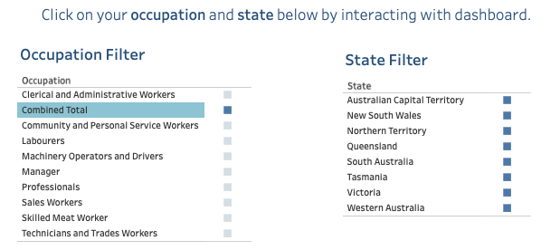
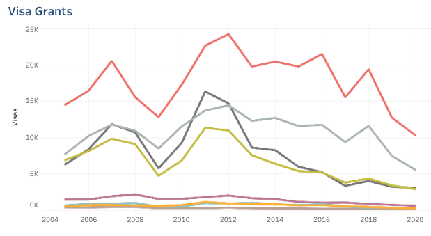

```{r setup, include=FALSE}
knitr::opts_chunk$set(echo = TRUE)
```

## Task

**The data is obtained from multiple sources** \doublespacing 

***Actions done with datasets***: cleaning & analysing

This is an assignment for the unit FIT3152, where we design our visualisation for the average Australian or Malaysian. 

Thus, the topic chosen is "Liveability in Australia", where I investigated and analysed the most liveable states in Australia. Factors include general household expenditure, employment rate, education, housing prices, transport cost and visa grant based on occupation. 

This visualisation aims to show the difference in how liveable each state is in Australia in terms of average cost and job opportunities available. Thus, helping aid their decision of potentially moving to a different state for job opportunities based on these factors. 

Tableau Public Dashboard: https://public.tableau.com/app/profile/ting.han.gan/viz/LiveabilityinAustralia/Liveabiltiy_AUS

### Interactive Filter for Users\doublespacing

```{r photo, echo=FALSE, out.width = '70%'}

```

### Example Graph within Dashboard\doublespacing

```{r photo1, echo=FALSE, out.width = '70%'}

```

